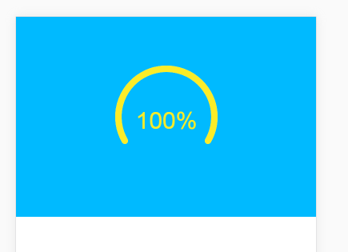
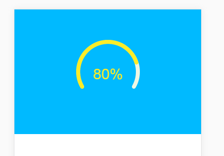
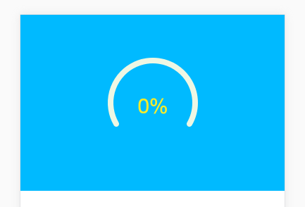

[TOC]

# canvas进度圆环

> 最近接手了一个 客户等级的需求, 要求开发一个用来动态显示用户等级进度的圆环, 于是写了个canvas 进度元 , 与大家共同分享
>
> 该方法通过不同的参数 可以改变圆环的起始位置和 结束位置, 你可以选择绘制一个半圆环 , 也可以绘制一个满圆环

## 先上图







## 代码示例

```javascript
/**
 * [绘制用户等级的 半圆环]
 * @param  {[type]} element   [绘制对象]
 * @param  {[type]} percent   [绘制圆环百分比, 范围[0, 100]]
 * @param  {[type]} forecolor [绘制圆环的前景色，颜色代码]
 * @param  {[type]} bgcolor   [绘制圆环的背景色，颜色代码]
 * @return {[type]}           [description]
*/

function drawMain(element, percent, forecolor, bgcolor) {
  var W = element.width / 2;
  var H = element.height / 2;
  var R = 60;
  var start = Math.PI*5/6;    // 圆环的起始位置
  var end = Math.PI*2 + (Math.PI/6);   // 圆环的结束位置
  var scale = ( end - start ) / 100;    // 比例
  var speed = 0;
  
  /*
  	...function
  */
}
```

`drawMain()` 也就是绘制圆环的方法;主要接受四个参数 , 四个参数就不说了 注释写的很清楚

说说 下面申明的四个变量

- start 

  > 由于 canvas 绘制圆中 0 与 2 PI 是在我们数学中的  X 轴正象限上 且是顺时针增加, 所以我的起始位置选择在 `Math.PI*5/6` 

- end 

  > 同理 我的结束位置设置为  `Math.PI*2 + (Math.PI/6)` 整体形成以大半圆的效果
  >
  > 不想计算这么麻烦的同学 也可以通过旋转来达到这种效果

- scale 

  这里设置的是一个比例 ,  这样能保证在  [0-100] 区间的进度能都能对应现显示在我们的canvas 圆环中

- speed

  顾名思义, 速度 , 主要用在 实现 页面加载时 进度条是以一个自增的形式 到达我们的指定位置

### 绘制背景圆圈

```javascript
function backgroundCircle(){
  ctx.save();
  ctx.beginPath();
  ctx.lineWidth = 8; //设置线宽
  ctx.lineCap = "round";   // 给圆环首尾加上 椭圆
  ctx.strokeStyle = bgcolor;
  ctx.arc(W, H, R, start, end, false);  //用于绘制圆弧ctx.arc(x坐标，y坐标，半径，起始角度，终止角度，顺时针/逆时针)
  ctx.stroke();
  ctx.closePath();
  ctx.restore();
}
```

### 绘制运动进度圆环

```javascript
function foregroundCircle(n){
  ctx.save();
  ctx.strokeStyle = forecolor;
  ctx.lineWidth = 8;
  ctx.lineCap = "round";
  ctx.beginPath();
  ctx.arc(W, H, R , start, start +n * scale, false); //用于绘制圆弧ctx.arc(x坐标，y坐标，半径，起始角度，终止角度，顺时针/逆时针)
  ctx.stroke();
  ctx.closePath();
  ctx.restore();
}
```

这里有两个方法需要注意一下  分别是 `ctx.lineCap = "round";` ,  `ctx.restore();` 

### 绘制文字

```javascript
function text(n){
  ctx.save(); //save和restore可以保证样式属性只运用于该段canvas元素
  ctx.fillStyle = forecolor;
  var font_size = 30;
  ctx.font = font_size + "px Helvetica";
  var text_width = ctx.measureText(n.toFixed(0)+"%").width;
  ctx.fillText(n.toFixed(0)+"%", W-text_width/2, H + font_size/2);
  ctx.restore();
}
```

### 最后执行动画

```javascript
(function drawFrame(){
  window.requestAnimationFrame(drawFrame);    // 开始动画帧
  ctx.clearRect(0, 0, element.width, element.height);
  backgroundCircle();
  text(speed);
  if(percent) {
    foregroundCircle(speed);
  }
  if(speed >= percent) return;
  speed += 1;
}());
```

###最后的调用
```javascript
drawMain(canvas, 100, "#fbec28", "#eef7e4");
//  这里 需要传入 canvas 对象,  进度[0-100]的形式, 前景色, 背景色
```

// 如果你看到了最后 那就请赏个 star 把 